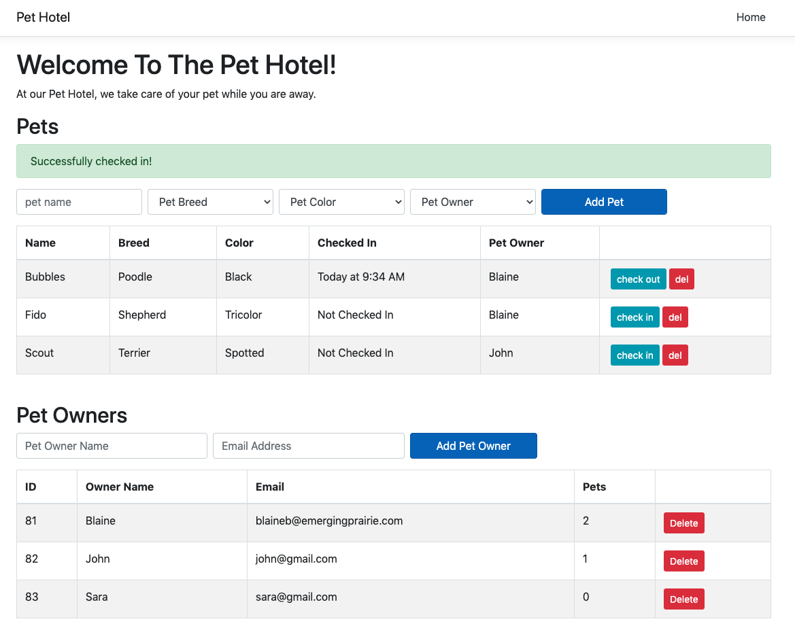

# Pet Hotel

This is a standard c-sharp project that was started with `dotnet new react --no-https -o project-name`. In addition:

  - Startup.cs has been updated so that `npm start` is not run in the background. Instead you must run `npm start` from the `ClientApp/` folder separately.
  - Postgres support is added and ready to go. The connection string can be updated in `appsettings.json`.
  - `package.json` stub has been added at the root level. This file exists only to satisfy the nodejs buildpack on heroku. It is not used in any way for the project.
  - `ClientApp/` has been updated to include react, redux, momentjs, and axios. `cd ClientApp && npm install` and away you go.

The client is available at `http://localhost:3000` and set up to proxy 
back to the dotnet API. The dotnet API is available at `http://localhost:5000/` and ALSO set up to proxy non-api requests to the webpack server. Both should work, although the convention for dotnet is to go directly through the dotnet app @ `http://localhost:5000`.

Please Note: If you get a 'Request failed with status code 431' error, this is likely a red herring (not a real error).
It is likely caused because your controllers do not have any valid routes set up yet.

## Screenshots
### Pet Hotel UI (working with base goals met)

### Passing Tests (npm test)

